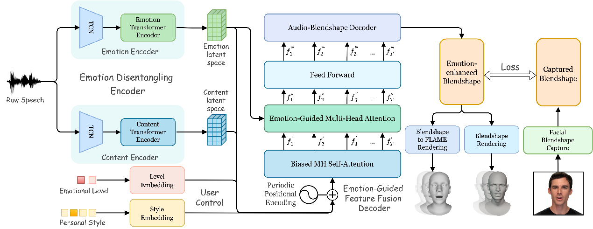

# **1 模型简介**

## **1.1模型解决的问题**

解开语音中的不同情绪，从而产生与之匹配的 3D 面部表情。

目前，基于学习的 3D面部动画因其可以产生高质量的动画效果和降低商业成本而备受欢迎，而EmoTalk项目提出的模型相比于当前主流研究，主要解决了3D面部动画中情绪的缺失问题。它不仅实现了各种情绪表达，而且超越了现有的最先进的方法。

以 Ji 等人的工作为基础，提出了一种改进的情感解缠编码器用于 3D面部动画生成。情绪解缠的过程是将情感与内容分开，这使神经网络能够学习更具体的特征，是语音处理中的关键挑战之一。

## **1.2模型使用的方法**

提出端到端的神经网络，将其用于语音驱动的情感增强 3D面部动画，方法的具体实现可以参考这张图理解。

{width="5.769444444444445in"
height="2.2305555555555556in"}

图中左侧的Emotion Disentanling Encoder（情绪解缠器），可以使用深度学习网络提取输入语音信号的内容特征和情感特征，解缠也就是确保两种特征彼此独立。

EmoTalk模型以多种方式简化和增强了原始的解缠模块。情绪解缠部分的改进包括使用带有预训练的音频特征提取器
wav2vec2.0，简化解开过程，以及使用端到端形式的模块直接输出面部动画所需的 52 个blendshape系数，让模型在训练过程中获得更好的约束。为了保证内容和情感之间的解开，模型还利用伪训练对将不同的情感和内容作为输入，经过处理生成交叉重构的blendshape
系数，并要求网络重建相应的真实样本作为输出。

图中中间的Emotion-guided feature fusiondecoder（情感引导特征融合器）使用基于 Transformer的特征融合模块，将内容和情感特征结合。

情感引导特征融合器可以使用音频中的情感信息将音频映射到 3D面部动画系数，旨在生成更具表现力的面部动画。Transformer结构允许全局特征的交互，有效提升融合精度和生成多样性。

采用一个由交叉重建损失、自我重建损失、速度损失和分类损失四部分组成的损失函数，来训练神经网络（对应图右侧：计算经过解缠和引导融合训练得到的blendshape系数和真实数据集blendshape之间的loss）。最终提取的blendshape系数可以驱动3D模型的面部运动，即通过控制面部关键点变化，生成对应的表情与嘴型。

## **1.3模型效果：**

定性评价：生成的3D动画表现出更真实的情感变化。

定量评价：相较于现有方法，该方法在情感准确性、面部运动自然性等指标上表现优异。

用户研究：主观评价显示生成动画更接近人类期望。

# **2 实验困难及解决方案**

## **2.1 无法连接hugging face。**

解决方案: 从hugging face下载模型到本地（我们放在根目录的models文件夹下）离线使用，需要下载的模型如下：

并修改model.py的EmoTalk类。

{width="5.249990157480315in"
height="3.4580653980752407in"}

图1：修改前model.py

{width="5.768055555555556in"
height="3.9375in"}

图2：修改后报错消失，项目可以正确调用预训练模型

## **2.2 Render无法找到正确的相对路径，会将result的中间结果存放到C盘默认路径下。**

{width="3.361626202974628in"
height="0.8891754155730534in"}

{width="5.768055555555556in"
height="0.6569444444444444in"}

解决方案：修改render.py的render_video函数确保中间结果的相对路径正确解析。

{width="5.768055555555556in"
height="3.9in"}

图3：修改前render.py

{width="5.768055555555556in"
height="3.4125in"}

图:4：修改后

最终可以看到路径正确转移到了项目的result文件夹下。

{width="5.768055555555556in"
height="2.877083333333333in"}

## **2. 3 项目使用了Linux环境而我们使用了Windows环境，blender和ffmpeg的配置、执行代码需要修改。**

首先需要下载Windows版本的blender并解压到根目录下，下载Windows版本的ffmpeg并修改环境变量。

然后修改render.py的render_video函数，确保ffmpeg可以在Windows下正确合成视频和删除目录。

{width="5.768055555555556in"
height="4.201388888888889in"}

图5：将原先的Linux专用代码修改为Windows下可运行代码

## **2.4 小结**

{width="2.7836034558180227in"
height="1.869028871391076in"}

图6：最终项目结构

Emotalk的环境部署大体上还算顺利但也碰到了一些头痛的问题，很高兴我们能齐心协力解决，主要的步骤总结如下：

1.  从github克隆代码并正确按照指令配置虚拟环境和安装库函数，其中需要手动下载的有hugging
    face的wav2vec2-large-xlsr-53-english模型和wav2vec-english-speech-emotion-recognition模型（均存放在models子文件夹下），以及作者仓库提供的EmoTalk.pth预训练参数（存放在pretrain_model子文件夹下）。

2.  下载解压Windows版本的blender并解压到根目录（blender文件夹），下载Windows版本的ffmpeg并配置环境变量，将render.py中涉及视频合成等步骤的代码修改为Windows版本的。

3.  修改render.py中result的相对路径相关代码，确保项目在任意工作目录下都可以正确存储中间结果，保证代码的稳定执行。

最终示例代码运行成功截图：

<img src="./images/media/image14.png" style="zoom:25%;" /{width="4.543745625546807in"
height="2.266402012248469in"}{width="4.521064085739282in"
height="2.145138888888889in"}

result文件夹下生成了以下两个文件，运行成功！

{width="2.720705380577428in"
height="1.542217847769029in"}
